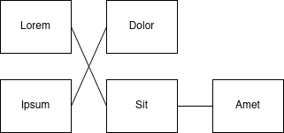
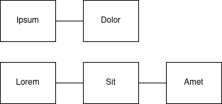

# Фронтенд разработчик - Coding Challenge

Ваша задача будет заключаться в написании приложения на React на TypeScript. Приложение должно:

1. Получать список доступных графов из `/api/graphs` с помощью запроса `GET`.
2. Получать данные выбранного графа из `/api/graphs/:id` с помощью запроса `GET`.
3. Организовывать узлы в столбцы.
4. "Распутывать" связи между столбцами узлов.
5. Отображать граф в SVG.
6. Вы не можете использовать никакие дополнительные библиотеки.

Для получения более подробной информации ознакомьтесь с этим файлом.

## Начало работы

 1. Запустите `yarn install`
 2. Запустите `yarn start`, чтобы запустить сервер разработки
 3. Начинайте реализацию приложения с `src/App.tsx`
 4. Запустите `yarn test`, чтобы увидеть, проходит ли ваше решение тестовый набор


## Список проверок

 - [ ] Есть выпадающий список для выбора одного графа из всех доступных графов
 - [ ] Выбранный граф немедленно отображается
 - [ ] Отображенный граф организован в столбцы
 - [ ] Узлы в столбцах упорядочены таким образом, чтобы их связи пересекались как можно меньше
 - [ ] Граф выглядит визуально приятно
 - [ ] **Ваше решение проходит набор тестов** (`yarn test`)

**Дополнительное задание**

 - [ ] Сделать узлы перетаскиваемыми с помощью мыши без использования библиотеки.


## API и формат данных

Все конечные точки возвращают данные в формате JSON в случае успеха. Ошибки могут быть простыми текстовыми ответами.

Конечная точка `/api/graphs` перечисляет несколько (заранее определенных) графов в следующем формате:

```typescript
interface GraphsList {
  graphs: number[]; // Идентификаторы доступных графов
}
```

Конечная точка `/api/graphs/:id` возвращает JSON-документ со следующей структурой:

```typescript
interface Graph {
  // можно разделить их на отдельные интерфейсы
  nodes: {
    id: number; // Уникальный идентификатор узла
    name: string; // Строковое имя узла, которое должно быть отображено
  }[];
  edges: {
    fromId: number; // Идентификатор узла, от которого начинается ребро
    toId: number; // Идентификатор узла, к которому ведет ребро
   }[];
}
```
## Укладка графа

Ваше приложение должно вычислять укладку для полученного графа.

 1. Сначала вы должны организовать узлы в отдельные столбцы. В первом столбце размещаются узлы, у которых есть только исходящие связи. Во втором столбце размещаются узлы, которые связаны с первым столбцом, и так далее, как показано на следующей схеме:
 


 2. Затем вы должны переупорядочить узлы внутри столбцов таким образом, чтобы связи между ними пересекались как можно меньше:



## Отображение графа

Вы должны отобразить раскладку графа в SVG.
 - Можно использовать CSS, чтобы граф выглядел максимально красиво.